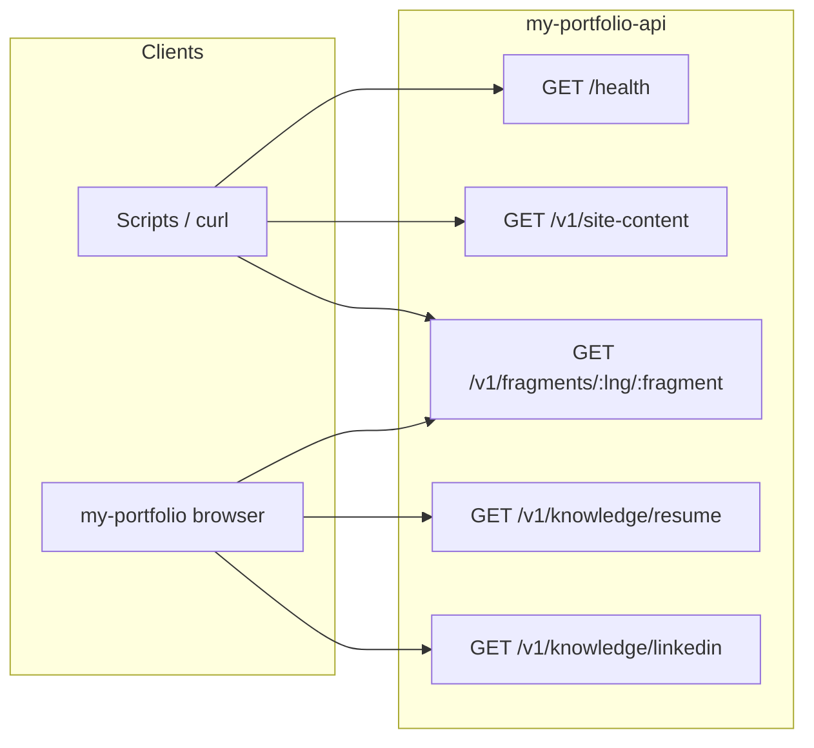

# my-portfolio-api

Small **Express** REST service that serves bilingual portfolio copy and chat knowledge files for the front-end app **[my-portfolio](https://github.com/kdutta25/my-portfolio)**. The site reads JSON from this API at build and runtime (`VITE_CONTENT_API_BASE_URL`).

---

## Quick start

```bash
npm install
npm start
```

The server listens on **`http://localhost:3001`** by default. Use **`npm run dev`** for `node --watch` reloads while editing `src/server.mjs`.

---

## Port and environment

| Variable | Default | Purpose |
|----------|---------|---------|
| **`PORT`** | `3001` | TCP port for the HTTP server. Override if the port is busy, e.g. `PORT=3002 npm start`. |
| **`API_BASE_PATH`** | _(empty)_ | If a reverse proxy serves this app under a prefix (e.g. `/api`), set `API_BASE_PATH=/api`. Routes become `{origin}/api/health`, `{origin}/api/v1/fragments/...`. The portfolio must then set **`VITE_CONTENT_API_BASE_URL`** to include that prefix (e.g. `https://www.example.com/api`). |
| **`SITE_CONTENT_CORS_ORIGINS`** | See below | Comma-separated list of allowed browser **`Origin`** values for CORS. If unset, origins include local Vite and production site hosts. |

**Default CORS origins** (when `SITE_CONTENT_CORS_ORIGINS` is not set):

- `http://localhost:4044`
- `http://127.0.0.1:4044`
- `https://www.kaustubhdutta.com`
- `https://kaustubhdutta.com`

Copy **`.env.example`** to `.env` and adjust as needed. The portfolio app should set **`VITE_CONTENT_API_BASE_URL`** to this service’s **origin** (and path prefix if you use **`API_BASE_PATH`**), e.g. `http://localhost:3001` — **not** the static portfolio origin alone unless `/v1` or `/api` is reverse-proxied to this process.

### If every `GET /v1/...` returns 404 from the browser

The SPA is probably calling **`https://www.kaustubhdutta.com/v1/...`** (or another static host). That site does not run Express. Point **`VITE_CONTENT_API_BASE_URL`** at this API’s public URL and rebuild the portfolio. If the API is only exposed under a path prefix, set **`API_BASE_PATH`** here and the same prefix in **`VITE_CONTENT_API_BASE_URL`**.

### Port already in use (`EADDRINUSE`)

Another process may be bound to `3001`. Either stop it or pick a free port:

```bash
PORT=3002 npm start
```

Point **`VITE_CONTENT_API_BASE_URL`** at `http://localhost:3002` (or whatever port you chose). To find a listener on macOS:

```bash
lsof -nP -iTCP:3001 -sTCP:LISTEN
```

---

## REST API reference

Base URL: **`{origin}`** (e.g. `http://localhost:3001`). All successful JSON responses use `Content-Type: application/json`.

### `GET /health`

Liveness check for load balancers or scripts.

| | |
|--|--|
| **Response** | `{ "ok": true }` |
| **Errors** | None for a healthy process. |

```bash
curl -s http://localhost:3001/health
```

---

### `GET /v1/site-content`

Returns the **full** site payload in one response: résumé corpus, LinkedIn snapshot, and **entire** English and French locale trees. Useful for tooling, refreshing test fixtures, or legacy clients.

| | |
|--|--|
| **Response** | `{ "resumeCorpus": { "resumeText": "..." }, "linkedinSnapshot": { ... }, "locales": { "en": { ... }, "fr": { ... } } }` |
| **Errors** | **`500`** `{ "error": "Failed to read site content files" }` if any backing file is missing or unreadable. |

```bash
curl -s http://localhost:3001/v1/site-content | head -c 200
```

---

### `GET /v1/fragments/:lng/:fragment`

Returns a **single top-level fragment** from the locale file for one language. This is what **my-portfolio** uses for incremental loading.

| Path parameter | Allowed values |
|----------------|----------------|
| **`lng`** | `en` or `fr` (other values → **`400`** `{ "error": "Invalid language" }`). |
| **`fragment`** | One of the keys below. Unknown key → **`404`** `{ "error": "Unknown fragment" }`. If the key is allowed but missing from the JSON file → **`404`** `{ "error": "Missing fragment in locale file" }`. |

**Allowed `fragment` values** (must exist under `data/locales/{lng}.json`):

| `fragment` | Typical use |
|------------|-------------|
| `site` | SEO / meta |
| `nav` | Navigation labels |
| `hero` | Hero section |
| `about` | About section |
| `skills` | Skills grid |
| `aiModels` | AI models subsection |
| `support` | Buy Me a Coffee |
| `githubActivity` | GitHub section |
| `experience` | Work history |
| `education` | Education |
| `projects` | Project cards |
| `volunteering` | Volunteering |
| `publications` | Publications |
| `chatbot` | Assistant strings |
| `footer` | Footer |

| | |
|--|--|
| **Response** | `{ "fragment": "<name>", "data": <object> }` — `data` is the JSON value for that key (object, array, or scalar). |
| **Errors** | **`500`** `{ "error": "Failed to read fragment" }` on unexpected read/parse failures. |

```bash
curl -s http://localhost:3001/v1/fragments/en/about | head -c 300
curl -s http://localhost:3001/v1/fragments/fr/nav
```

---

### `GET /v1/knowledge/resume`

Returns the résumé corpus used by the portfolio chat matcher.

| | |
|--|--|
| **Response** | `{ "resumeText": "..." }` (shape matches `data/resume-corpus.json`). |
| **Errors** | **`500`** `{ "error": "Failed to read resume corpus" }`. |

```bash
curl -s http://localhost:3001/v1/knowledge/resume | head -c 200
```

---

### `GET /v1/knowledge/linkedin`

Returns the LinkedIn snapshot used by the portfolio chat matcher.

| | |
|--|--|
| **Response** | Object with fields such as `headline`, `location`, `summary`, `linksNote` (see `data/linkedin-snapshot.json`). |
| **Errors** | **`500`** `{ "error": "Failed to read LinkedIn snapshot" }`. |

```bash
curl -s http://localhost:3001/v1/knowledge/linkedin
```

---

## Data layout (`data/`)

| Path | Role |
|------|------|
| `data/locales/en.json` | English bundle; top-level keys must include every **fragment** name you expose. |
| `data/locales/fr.json` | French bundle; same key structure as `en.json`. |
| `data/resume-corpus.json` | Plain résumé text for chat / `site-content`. |
| `data/linkedin-snapshot.json` | Short LinkedIn summary for chat / `site-content`. |

Locale files are cached in memory after first read (per language).

---

## Scripts (`package.json`)

| Script | Command | Purpose |
|--------|---------|---------|
| **start** | `npm start` | Run `node src/server.mjs`. |
| **dev** | `npm run dev` | Run with `node --watch` for automatic restarts. |
| **content:refresh** | `npm run content:refresh` | Runs `python3 scripts/refresh-resume-corpus.py` to regenerate `data/resume-corpus.json` from `public/Kaustubh-Dutta-Resume.pdf` (place the PDF first). |

---

## Relationship to my-portfolio

- The SPA loads **`GET /v1/fragments/{lng}/{key}`** for many keys during bootstrap and can load knowledge via **`/v1/knowledge/*`**.
- **`GET /v1/site-content`** is optional for bulk export; the live app is built around **fragments + knowledge** endpoints.
- Configure the front-end with **`VITE_CONTENT_API_BASE_URL`** (recommended) pointing at this API’s origin.

---

## API surface (overview)



---

## Security note

This service is intended for **public portfolio content**. It does not implement authentication. In production, place it behind your hosting/CDN rules as appropriate.

---

## Open a merge request (branch `kausdutt/ImplementationAPI`)

This folder must be a **git clone** with `origin` set to your Git host (for example GitHub). From the repo root:

```bash
git checkout main
git pull origin main
git checkout -b kausdutt/ImplementationAPI
# ensure README.md changes are saved, then:
git add README.md
git commit -m "docs: document REST API, port, and data layout"
git push -u origin kausdutt/ImplementationAPI
```

Then open a **pull request / merge request** against `main` (GitHub: compare URL  
`https://github.com/<org-or-user>/my-portfolio-api/compare/main...kausdutt/ImplementationAPI` — replace the owner if your fork differs).
